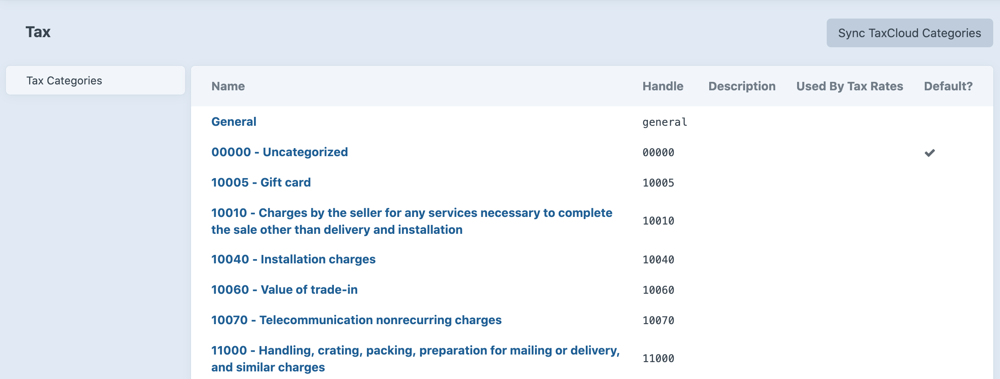

# TaxCloud plugin for Craft CMS 3.x

TaxCloud integration for Craft Commerce

> :warning: The TaxCloud API only supports US destinations. This plugin takes over the built-in tax engine so Commerce will not calculate non-US taxes or use custom tax rules when installed.

## Requirements

This plugin requires Craft Commerce (Pro edition) 3.1 or later.

## Installation

To install the plugin, follow these instructions.

1. Open your terminal and go to your Craft project:

        cd /path/to/project

2. Then tell Composer to load the plugin:

        composer require surprisehighway/craft-taxcloud

3. In the Control Panel, go to Settings → Plugins and click the “Install” button for TaxCloud.


## Configuring TaxCloud

### Step 1: Configure the plugin

Add your API connection settings and plugin defaults:

1. Define `TAXCLOUD_API_ID` and `TAXCLOUD_API_KEY` environmental variables in your `.env` file.

```
# Set your TaxCloud API ID
TAXCLOUD_API_ID="xxxxxxxx"

# Set your TaxCloud API Key
TAXCLOUD_API_KEY="xxxxxxxxxxxxxxxxxxxxxxxxxxxxxxxxxxxx"

```

2. Create a `config/taxcloud.php` file using the example found at `vendor/surprisehighway/taxcloud/config.php`

```
<?php

return [
	'apiId' => getenv('TAXCLOUD_API_ID'),
	'apiKey' => getenv('TAXCLOUD_API_KEY'),
	'verifyAddress' => false,
	'enableCapture' => true,
	'defaultShippingTic' => '11010',
];
```

> **TIP:** You can check your connection settings by navigating to [your_cp_url]/actions/taxcloud/categories/ping

## Step 2: Sync your tax categories

To sync your tax categories with [TaxCloud's TICs](https://taxcloud.com/TIC), go to Commerce → Tax → Tax Categories in the control panel and click the "Sync TaxCloud Categories" button.

Once the sync is complete **assign the categories you will use to your Product Types** to make them available for selection in your product entries. Most likely you will want to set a default category as well, such as "Uncategorized - 00000".



> **Warning:** Don't change the tax category handles, they are used to keep the categories in sync so you could potentially cause duplicates. Note that the handle is the actual [TIC code](https://taxcloud.com/TIC) value that is sent to TaxCloud. You can change the name and description. 

## Step 3: Check your store location

Got to Commerce → Store Settings → Store Location and make sure the address is set correctly. This will be used as the shipping Origin by TaxCloud and is required.


## Using TaxCloud

Once everything is set up tax adjustments will be added to new orders automatically based on the line items's Tax Category in the product entry.

> **Note:** TaxCloud returns the sales tax per line item, and the plugin sets the total tax as an order adjustment.

The full TaxCloud API response is stored in the order adjustment's `sourceSnapshot` in the `craft_commerce_orderadjustments` database table.

### A note about address verification

The TaxCloud service depends on a valid address to calculate sales Tax. If you are not doing address validation in some other way, you may enable address verification in the plugin by setting the config option `"verifyAddress" => true`.

If address verification is enabled, the plugin will attempt to verify the address using the [TaxCloud API](https://dev.taxcloud.com/taxcloud/guides/2%20Verify%20an%20Address), and if TaxCloud returns a verified address the subsequent tax lookup will use the verified address. The verified address for example will contain the zip+4 even if the user did not enter it, making tax calculation more accurate. **If a verifed address is not matched the tax lookup will still be submitted** per TaxCloud's guidelines.

### A note about sales and discounts

TaxCloud does not accept separate line item discounts or adjustments. Items on Sale in Craft automatically send the sale price to TaxCloud for tax calculation. Discounts are calculated by the plugin to send the reduced line item price to TaxCloud for tax calculation [per TaxCloud guidelines](https://taxcloud.com/support/applying-discounts). 

## TaxCloud Roadmap

Some things to do, and ideas for potential features:

- [x] Release it
- [x] Replace the built-in tax engine in Craft Commerce
- [x] Manage product TICs suing tax categories synced from TaxCloud
- [x] Live rates from TaxCloud
- [x] Authorize and Capture orders in TaxCloud for reporting purposes
- [x] Handle discounts
- [ ] Handle refunds

Brought to you by [Surprise Highway](https://surprisehighway.com)

## Credits

This plugin is largely based on the first-party TaxJar plugin in code and the approach of using tax categories rather than a field for TICs.
